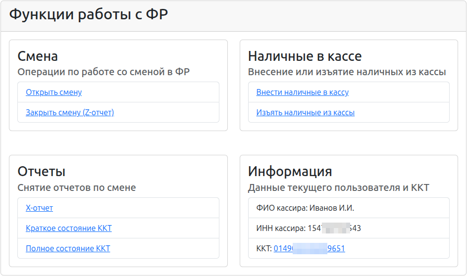
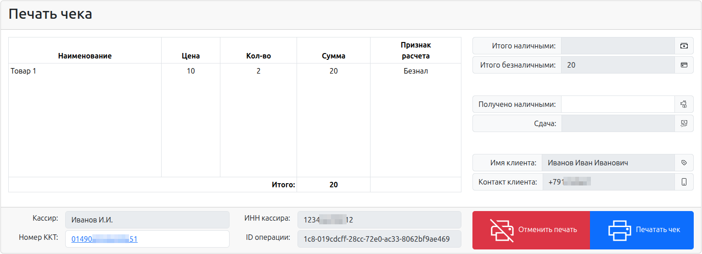

# KKM Server Classes 🇷🇺

[](https://www.php.net/)
[](https://opensource.org/licenses/MIT)

PHP библиотека классов для работы с кассовыми аппаратами (ККТ) через KKM Server. Предоставляет удобный API для создания команд, печати чеков и управления сменами в кассовых аппаратов.

## 📋 Описание

**KKM Server Classes** — это PHP библиотека, разработанная для взаимодействия с кассовыми аппаратами (ККТ) через KKM Server. Библиотека имеет функции:

- 📝 **Печать чеков** с поддержкой различных типов платежей
- 🔄 **Управление сменой** (открытие/закрытие)
- 📊 **Получение отчётов** (X-отчёты, Z-отчёты)
- 💳 **Обработка платежей** (наличные, электронные, авансовые)
- 💰 **Инкассация и пополнение** кассы
- 🏪 **Работа с устройствами** и получение данных ККТ

Библиотека полностью совместима с российской системой фискализации и поддерживает все основные функции современных кассовых аппаратов.

## 🎯 Основные возможности

### Команды ККТ

| Команда | Описание |
|---------|---------|
| `Cheque` | Печать товарного чека с поддержкой различных видов платежей |
| `OpenShift` | Открытие смены на кассовом аппарате |
| `CloseShift` | Закрытие смены с выведением Z-отчёта |
| `XReport` | Печать X-отчёта (внутренний отчёт смены) |
| `ZReport` | Печать Z-отчёта (итоговый отчёт смены) |
| `PaymentCash` | Инкассация (изъятие) наличных денежных средств |
| `DepositingCash` | Пополнение кассы наличными среди наличными |
| `GetDataKKT` | Получение технических данных о кассовом аппарате |
| `DeviceList` | Получение информации о подключённых устройствах |

### Типы платежей

- 💵 **Наличные** (Cash)
- 💳 **Электронные платежи** (Electronic)
- 🎫 **Предоплата** (Advanced)
- 📋 **Кредит** (Credit)
- 🏦 **Кассовое обеспечение** (CashProvision)

### Типы чеков

- ✅ Продажа/Приход
- 🚫 Возврат продажи
- 🚫 Корректировка продажи
- 🚫 Покупка/Расход
- 🚫 Возврат покупки
- 🚫 Корректировка покупки

## 📦 Требования

- PHP >= 8.1
- Composer
- OpenSSL PHP extension

### Зависимости

```
php: ^8.1
twig/twig: ^3.23
twbs/bootstrap: 5.3.8
symfony/http-foundation: ^8.0
symfony/serializer: ^8.0
symfony/property-access: ^8.0
phpdocumentor/reflection-docblock: ^6.0
symfony/serializer-pack: ^1.3
ramsey/uuid: ^4.9
monolog/monolog: ^3.10
```

## 🚀 Установка

### Через Composer

```bash
composer require djalone/kkm-server-classes
```

## 💡 Использование

### Меню работы с ККТ

```php
<?php
...
/* Получите ИНН и ФИО кассира обычным для вас способом */
    $cashierINN = $lib->getCashierInn();
    $cashierName = $lib->getCashierName();
...
/* Выведите ссылку на меню */
echo "<a href=\"path-to-your-vendor-dir/frontend/menu.php?cashierName={$cashierName}&cashierVatin={$cashierVatin}\">Меню работы с ККТ </a>";
...
```
При переходе будет меню для работы



### Базовый пример: Печать чека

```php
<?php

use Djalone\KkmServerClasses\Cheque;
use Djalone\KkmServerClasses\Cheque\Enums\PaymentTypes;
use Djalone\KkmServerClasses\Cheque\Items\Position;
use Djalone\KkmServerClasses\Services\CustomGUID;
use Djalone\KkmServerClasses\Services\Serializer;
use Djalone\KkmServerClasses\Services\Helper;

require_once 'vendor/autoload.php';

// Создание чека
$cheque = new Cheque(
    'Иванов И.И.',                // Имя кассира
    '123-----12',                 // ИНН кассира
    '',                           // Номер ККТ (опционально)
    CustomGUID::getCommandGuid()  // Уникальный идентификатор команды
);

// Установка информации о клиенте
$cheque
    ->setClientAddress('+791-------')
    ->setClientInfo('Иванов Иван Иванович');

// Добавление товара в чек
$cheque->addItem(
    (new Position('Товар 1', 1000, 2000))  // название, цена в копейках, количество в тысячных долях
        ->setPaymentType(PaymentTypes::Electronic)
);
// Определите ссылку callBack для получения ответа от фронтенда
$callBackUrl = '/my-callback-url.php';

...
// Выведите форму на экран с разу выполните переход
    echo Helper::echoForm($cheque,$callBackUrl);
...
```
После вызова, вы будете переброшены на страницу для работы печатью

## 📁 Структура проекта

```
src/
├── Command.php                         # Базовый класс для всех команд
├── Cheque.php                          # Класс чека
├── OpenShift.php                       # Команда открытия смены
├── CloseShift.php                      # Команда закрытия смены
├── XReport.php                         # X-отчет
├── GetDataKKT.php                      # Получение данных ККТ
├── PaymentCash.php                     # Инкассация наличных
├── DepositingCash.php                  # Пополнение кассы
├── DeviceList.php                      # Список устройств
├── Cheque/                             # Элементы для работы с чеком
│   ├── Enums/                          # Перечисления (типы оплаты, налоги и т.д.)
│   │   ├── PaymentTypes.php            # Тип платежа за услугу
│   │   ├── ChequeType.php              # Тип чека
│   │   ├── Tax.php                     # Налоговые ставки
│   │   ├── MeasureOfQuantity.php       # Единицы измерения товаров
│   │   ├── SignMethodCalculation.php   # Признак способа расчета
│   │   └── SignCalculationObject.php   # Признак предмета расчета
│   └── Items/                          # Элементы документа (позиции, текст, изображения)
│       ├── Position.php                # Позиция чека (товар или услуга)
│       ├── Text.php                    # Текст в чеке (нефискальная печать)
│       ├── Image.php                   # Изображение на чеке
│       └── Barcode/                    # Штрих-коды
└── Services/                           # Сервисы для помощи в работе с библиотекой
    ├── Serializer.php                  # Сериализация в JSON
    ├── Logger.php                      # Логирование
    ├── Helper.php                      # Вспомогательные функции
    ├── CustomGUID.php                  # Генерация GUID
    └── ...

tests/
├── CloseShiftTest.php
├── OpenShiftTest.php
├── PaymentCashTest.php
├── XReportTest.php
├── GetDataKKTTest.php
├── DepositingCashTest.php
└── ...

frontend/                               # Фронтенд (PHP + HTML + JavaScript)
├── js/                                 # Обработка JS
│   ├── base/                           # Общие для всего фронтенда скрипты
│   │   ├── baseFunctions.js            # Базовые функции для работы с сервером ККМ
│   │   ├── kkmSwitcher.js              # Переключатель между ККТ
│   │   ├── moment-with-locales.js      # Библиотека работы с датами
│   │   └── operationsModal.js          # Всплывающее окно информации о поведении
│   ├── menu/                           # Скрипты для работы в меню
│   │   ├── inOutCash.js                # Обработка внесения наличных и инкассации
│   │   ├── kkmServer.js                # Работа со статусом ККТ
│   │   └── simpleOperations.js         # Простые операции (открытие/закрытие смены, отчеты и т.д.)
│   ├── printer/                        # Скрипты для работы с чеком
│   │   ├── callBack.js                 # Обработчик обратного вызова в систему
│   │   ├── interface.js                # Автономные функции интерфейса
│   │   └── printer.js                  # Работа с ККТ для печати чека
├── templates/                          # Twig-шаблоны для интерфейса
├── menu.php                            # Меню взаимодействия с ККТ
└── printer.php                         # Фронтенд для печати чека
backend/                                # Бэкенд для работы с фронтендом
```

## 🧪 Тестирование

Проект включает полный набор unit-тестов с использованием PHPUnit.

### Запуск всех тестов

```bash
php vendor/bin/phpunit tests
```

### Запуск тестов конкретного класса

```bash
php vendor/bin/phpunit tests/ChequeTest.php
```

### Запуск тестов с отчётом о покрытии

```bash
php vendor/bin/phpunit --coverage-html coverage/
```

## 🛠️ Разработка и инструменты

### Исправление стиля кода

Проект использует **PHP CS Fixer** для автоматического исправления стиля кода:

```bash
php vendor/bin/php-cs-fixer fix src/
php vendor/bin/php-cs-fixer fix tests/
```

### Статический анализ

**PHPStan** используется для статического анализа кода:

```bash
php vendor/bin/phpstan analyse src/ --level=9
```

### Рефакторинг

**Rector** помогает автоматизировать рефакторинг кода:

```bash
php vendor/bin/rector process src/
```

## 📝 API Документация

### Класс Cheque

#### Основной конструктор

```php
public function __construct(
    string $cashierName = '',
    string $cashierVatin = '',
    string $kktNumber = '',
    string $idCommand = ''
)
```

#### Основные методы

- `addItem(Item $item): self` — добавить товар/элемент
- `setChequeType(ChequeType $type): self` — установить тип чека
- `setClientEmail(string $email): self` — установить email клиента
- `setClientPhone(string $phone): self` — установить телефон клиента
- `setClientAddress(string $address): self` — установить адрес клиента
- `setClientInfo(string $info): self` — установить ФИО/названия компании
- `setClientINN(string $inn): self` — установить ИНН клиента
- `toArray(): array` — получить массив параметров команды

### Класс Position

#### Конструктор

```php
public function __construct(
    string $name,           // Название товара
    int $price,            // Цена в копейках
    int $quantity          // Количество в тысячных долях (1000 = 1 шт)
)
```

#### Методы

- `setPaymentType(PaymentTypes $type): self` — установить тип платежа
- `setTax(Tax $tax): self` — установить налоговую ставку
- `setDepartment(int $id): self` — установить номер отдела
- `setMeasureOfQuantity(MeasureOfQuantity $measure): self` — установить единицу измерения

### Сервис Serializer

```php
public static function serializeCheque(Cheque $cheque): string
// Возвращает JSON-строку команды чека

public static function deserializeCheque(string $json): Cheque
// Десериализует JSON обратно в объект Cheque
```

### Сервис Logger

```php
Logger::getInstance()->info('Сообщение', ['дополнительные' => 'данные']);
Logger::getInstance()->error('Ошибка');
Logger::getInstance()->warning('Предупреждение');
```

## 📊 Примеры интеграции

### Интеграция с веб-приложением

Смотрите папку `frontend/` и `backend/` для примеров практической интеграции:

```
frontend/menu.php         # Интерфейс меню управления ККТ
frontend/printer.php      # Обработчик печати чеков
backend/testCallback.php  # Пример обработчика callback
```

## 🐛 Обработка ошибок

Все команды наследуют базовый класс `Command`, который включает обработку ошибок:

```php
$cheque = new Cheque(...);
// ... конфигурация ...

if ($cheque->isValid()) {
    $json = Serializer::serializeCheque($cheque);
} else {
    $errors = $cheque->getErrors();
    // Обработка ошибок
}
```

## 🔐 Безопасность

- Все входные данные обрабатываются и валидируются
- Используются типизированные свойства PHP 8.1+
- Поддержка UUID для уникальных идентификаторов команд
- Логирование всех операций с ККТ

## 📄 Лицензия

MIT License - смотрите файл [LICENSE](LICENSE) для деталей.

## 👤 Автор

**Egor Ermilov**
- Email: egor.ermilov1992@gmail.com

## 🤝 Вклад

Улучшения, исправления ошибок и новые функции приветствуются!

## 📚 Дополнительные ресурсы

- [PHP Documentation](https://www.php.net/docs.php)
- [Symfony Serializer Docs](https://symfony.com/doc/current/serializer.html)
- [PHPUnit Documentation](https://phpunit.de/documentation.html)
- [KKM Server Documentation](https://kkmserver.ru/)